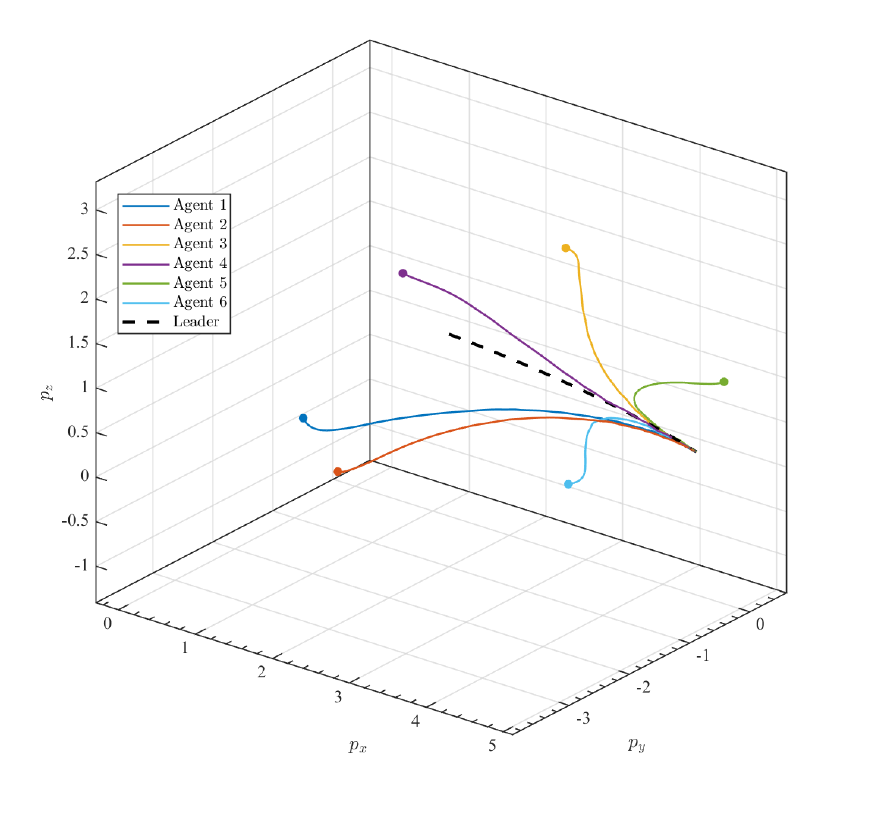
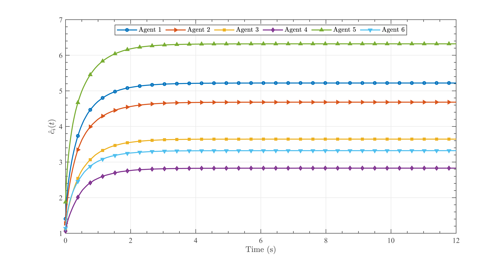
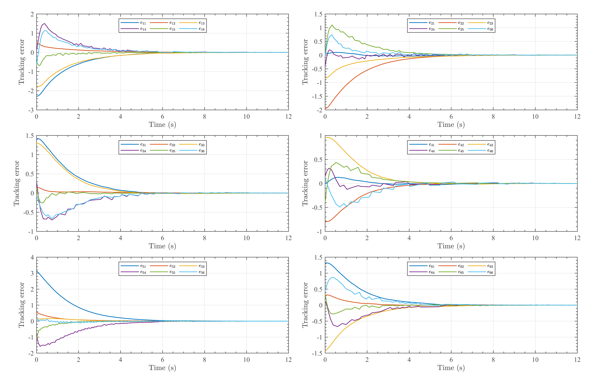
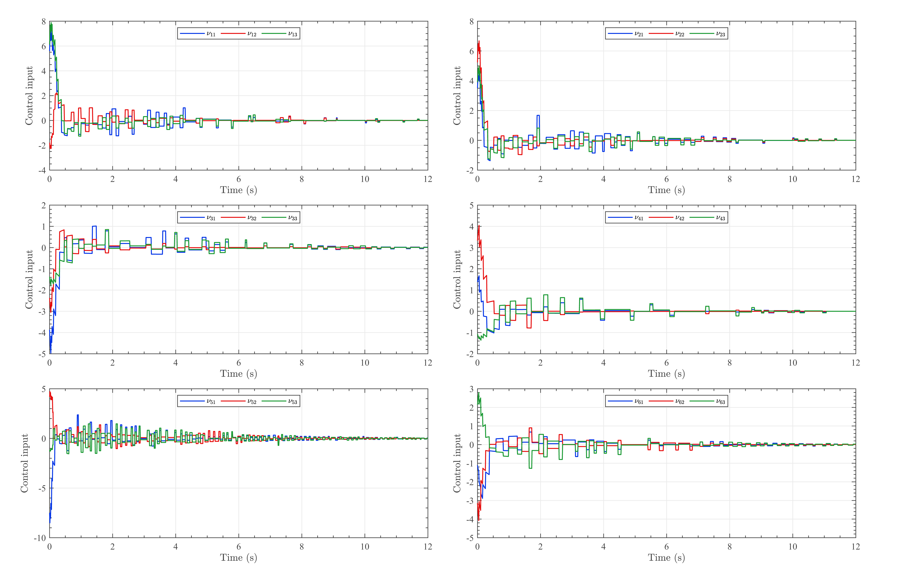
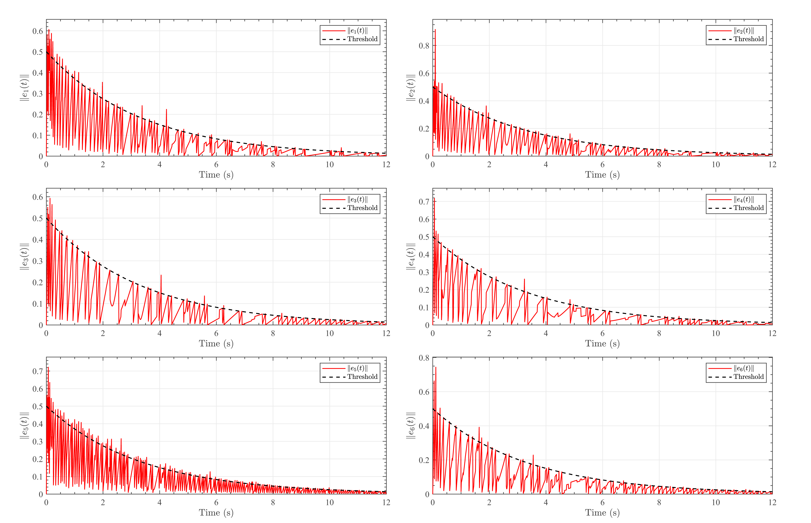

# Additional Validation for a Sixth-Order Multi-Agent System

 &emsp;&emsp;An additional experiment is conducted to examine whether the proposed method remains effective when the agent-state dimension is increased from \(n=2\) to \(n=6\). The network contains one leader and six followers and uses the same directed topology, MITM model, residual-gating mechanism, event-triggering rule, and adaptive protocol as the main experiment. Each agent has the state
$x_i=
[p_{x,i},p_{y,i},p_{z,i},v_{x,i},v_{y,i},v_{z,i}]^{\mathrm T},$
and its dynamics are described by
$\dot x_i(t)=A_6x_i(t)+B_6\nu_i(t),$
where

$$
A_6=
\begin{bmatrix}
0&0&0&1&0&0\\
0&0&0&0&1&0\\
0&0&0&0&0&1\\
0&0&0&-0.25&0.08&-0.04\\
0&0&0&-0.08&-0.25&0.06\\
0&0&0&0.04&-0.06&-0.25
\end{bmatrix},
\qquad
B_6=
\begin{bmatrix}
0&0&0\\
0&0&0\\
0&0&0\\
1&0&0\\
0&1&0\\
0&0&1
\end{bmatrix}.
$$

The off-diagonal terms in the lower-right block of $A_6$ introduce cross-axis velocity coupling, so this model is not simply composed of three independently simulated second-order subsystems. The pair $(A_6,B_6)$ is controllable. By selecting $Q=I_6$ and $R=I_3$ in the CARE, the feedback matrix is obtained as

$$
K=
\begin{bmatrix}
0.9987&-0.0453&0.0236&1.4993&0.0002&0.0004\\
0.0460&0.9984&-0.0337&0.0002&1.4991&0.0003\\
-0.0220&0.0348&0.9992&0.0004&0.0003&1.4995
\end{bmatrix},
$$

for which $A_6-B_6K$ is Hurwitz.

 &emsp;&emsp;The simulation horizon is $12\,\mathrm{s}$, with an integration step of $0.01\,\mathrm{s}$. The FF and LF attack probabilities are $0.10$ and $0.08$, respectively, while the corresponding sector-bound parameters are $\varrho_F=0.8$ and $\varrho_L=0.6$. Applying the threshold-selection procedure to the sixth-order residual samples gives
$\gamma^F=0.9437292,
\gamma^L=5\times10^{-7}.$
The event-triggering parameters are $c_1=0.5$ and $\alpha=0.3$. After threshold selection, $50$ independent Monte Carlo simulations are performed. The mean steady-state total MSE is $2.6312\times10^{-2}$, the mean triggering rate is $7.4657\times10^{-2}$, and the FF attack-leakage rate is $2.7572\times10^{-3}$. No LF attack leakage is observed in the reported simulations.

**Figure S1.** Three-dimensional trajectories of the leader and six followers.

&emsp;&emsp;Figure S1 shows that the followers start from widely separated positions and follow different transient paths because of their heterogeneous initial conditions, local information, and attack realizations. Nevertheless, all six trajectories gradually merge with the dashed leader trajectory. The curved transient paths also reflect the cross-axis coupling introduced in $A_6$, since the motion along one spatial direction is affected by the velocity components along the other directions. The convergence is therefore achieved for a genuinely coupled three-dimensional motion model rather than through three independent scalar tracking processes. No follower exhibits persistent deviation after the transient, indicating that residual-based packet rejection does not disconnect the effective leader-follower information flow.

**Figure S2.** Adaptive coupling gains of the six followers.

&emsp;&emsp;As shown in Figure S2, all adaptive gains increase rapidly during the initial synchronization stage and then approach finite steady-state values. The gain variations become negligible after approximately $3-4\mathrm{s}$, which coincides with the main reduction in the tracking errors. The gains converge to different levels because each follower experiences a different local disagreement signal under the directed topology. In particular, Agent 5 reaches the largest gain, approximately $6.3$, suggesting that it requires stronger effective coupling to compensate for its local disagreement and screened information flow. Agent 4 converges to the smallest value, approximately $2.8$. Despite this heterogeneity, every gain remains well below the prescribed upper bound of $12$, supporting the bounded adaptive-gain implementation used in the stability analysis.

**Figure S3.** Six state-component tracking errors of each follower.

&emsp;&emsp;Figure S3 provides a componentwise view of the synchronization process. The position-error components generally dominate the initial transient, whereas the velocity errors decay more rapidly and remain relatively small afterward. Some components exhibit short fluctuations or nonsmooth variations during the first several seconds. These variations result from the combined effects of event-triggered updates, predictor resets, residual-gating decisions, and randomly occurring MITM attacks. They remain transient and do not produce sustained oscillations. By approximately $6-8\mathrm{s}$, all 36 component errors have entered a small neighborhood of zero. The result demonstrates that the convergence observed in the three-dimensional trajectories is not caused by cancellation among different state components; both the position and velocity errors are individually reduced.

**Figure S4.** Three control-input components of each follower.

&emsp;&emsp;The control inputs in Figure S4 exhibit relatively large initial amplitudes because the followers begin with substantial position and velocity disagreements. The input magnitudes then decrease as synchronization is established. Their piecewise-varying profiles are consistent with the use of event-triggered, sample-and-hold disagreement information. Short input adjustments continue during the intermediate stage because accepted packets update the predictors and modify the residual-gated disagreement signals. These adjustments become less frequent and smaller after the tracking errors decrease. All three control components eventually approach zero, showing that the controller does not require persistent high-amplitude actuation to maintain synchronization. The comparatively larger initial inputs of Agents 1 and 5 are also consistent with their larger transient errors and adaptive coupling gains.

**Figure S5.** Event-triggering errors and the corresponding decaying thresholds.

&emsp;&emsp;Figure S5 shows the characteristic repeated growth-and-reset behavior of the triggering errors. Between successive events, each error grows as the held disagreement signal deviates from its current value. Once the triggering condition is activated, the held signal is updated and the triggering error is reduced. Packet arrivals and predictor resets may also cause instantaneous changes in the disagreement signal, explaining several isolated peaks in the curves. The amplitudes and reset frequencies differ among followers because their local disagreements, neighbor sets, and accepted-packet sequences are different. Agent 5 exhibits relatively dense triggering activity during the transient, consistent with its larger adaptive gain and stronger local compensation requirement. As synchronization progresses, both the triggering thresholds and error amplitudes decrease, while triggering events remain distributed over the complete simulation interval rather than accumulating at a finite time. Together with the mean triggering rate of approximately 7.47%, these results show that the sixth-order implementation retains the communication-saving behavior of the proposed event-triggered mechanism.

&emsp;&emsp;Overall, the sixth-order results demonstrate that the residual gate, passive predictor, event-triggering mechanism, CARE-based feedback matrix, and adaptive coupling law can be applied without structural modification when the agent-state dimension is increased to six. The experiment therefore supports scalability with respect to the individual agent-state dimension, while scalability with respect to a substantially larger number of agents remains a separate topic.
